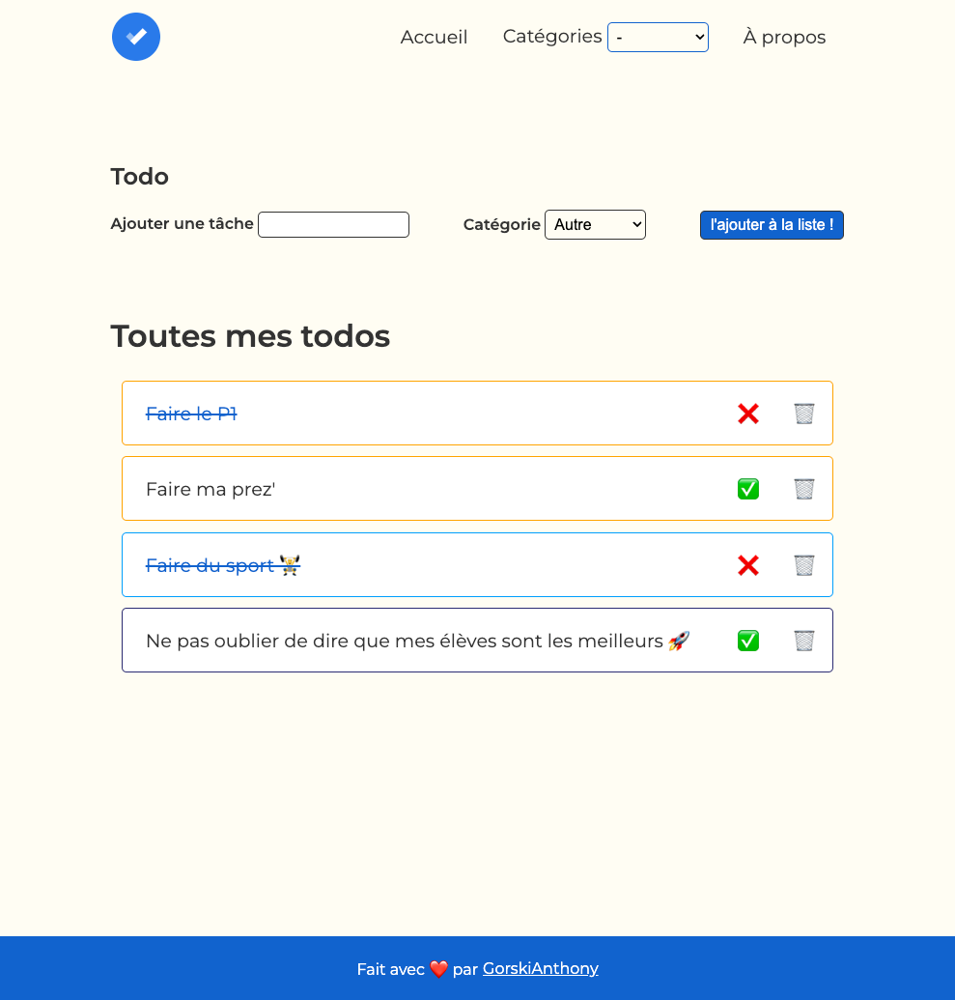

<h1 align="center">Welcome to todo list 👋</h1>

  
  

> Une todo list de la wild

## 🏡 Homepage

[Todo Anthony](https://wildcodeschool-2023-09.github.io/JS-RemoteFR-SACOD-P1-Anthony/)

## Author

👤 **Anthony Gorski**

-   Twitter: [@Gorski_Anthony](https://twitter.com/Gorski_Anthony)
-   GitHub: [@GorskiAnthony](https://github.com/GorskiAnthony)

## Show your support

Give a ⭐️ if this project helped you!

---

👋 Qui suis-je ?
Je suis **Anthony Gorski**, développeur web et formateur à la [Wild Code School](https://www.wildcodeschool.com/fr-FR).
